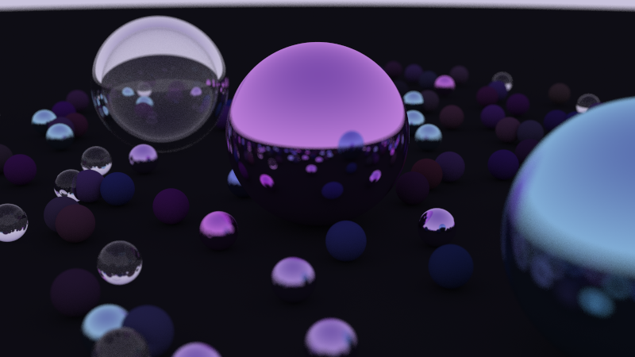

# Ray Tracer

A C++ ray tracer built while working through _Ray Tracing in One Weekend_. This project is a learning-focused renderer that builds the graphics pipeline from first principles: vectors, rays, hittable objects, sphere intersections, camera setup, antialiasing, recursive ray scattering, diffuse materials, reflective metal surfaces, dielectric glass, refraction, a positionable camera, and depth-of-field style defocus blur.



_Final render: a randomized multi-sphere scene with glass, hollow dielectric bubbles, reflective metal materials, defocus blur, recursive bounces, and a custom purple/blue scene palette._

## Final Render


The final scene uses a large procedural sphere field around three hero objects: a hollow glass sphere, a reflective purple metal sphere, and a blue metal sphere. It renders at 800px width with 500 samples per pixel, recursive scattering, dielectric refraction, reflective materials, and camera defocus blur.

## Implemented Features

- [x] Vector math (`vec3`)
- [x] Rays and camera ray generation
- [x] Sphere intersections
- [x] Hittable object abstraction
- [x] Multiple objects through a hittable list
- [x] Surface normal visualization
- [x] Antialiasing through multisampling
- [x] Recursive ray scattering with configurable max bounce depth
- [x] Lambertian diffuse material
- [x] Reflective metal material
- [x] Configurable metal fuzz for sharper or softer reflections
- [x] Dielectric/glass material
- [x] Refraction using Snell's law
- [x] Schlick-style reflectance approximation
- [x] Hollow glass sphere setup using nested dielectric spheres
- [x] Positionable camera with `lookfrom`, `lookat`, `vup`, and vertical field of view
- [x] Defocus blur / depth of field using aperture angle, focus distance, and random lens-disk sampling
- [x] Randomized final scene generation with diffuse, metal, and dielectric spheres
- [x] Higher-sample final render pass
- [x] Shadow-acne avoidance using a small ray-hit epsilon
- [x] PPM output and PNG conversion workflow

## Highlights

- Implements a small ray tracing renderer in C++.
- Builds core rendering primitives from scratch: `vec3`, `ray`, `sphere`, `hittable`, `hittable_list`, `interval`, `color`, and `camera`.
- Adds a material abstraction with `lambertian`, `metal`, and `dielectric` surface scattering.
- Uses recursive rays to model light bounces, reflections, refraction, attenuation, and object-to-object reflections.
- Implements a movable camera with field-of-view controls, focus distance, and defocus blur.
- Builds a randomized final scene with many small spheres and three larger hero materials.
- Renders to PPM and converts the output to PNG for viewing.
- Adds antialiasing with multiple jittered samples per pixel.
- Includes a learning log in `notes.md` explaining the rendering math and implementation decisions.

## Tech Stack

- C++
- CMake
- ImageMagick for converting `.ppm` renders to `.png`

## Build and Run

Configure and build:

```bash
cmake -B build
cmake --build build
```

Render the image:

```bash
build\Debug\inOneWeekend.exe > image.ppm
```

Convert the render to PNG:

```bash
magick image.ppm image.png
```

## Project Structure

- `main.cpp`: Builds the scene and starts rendering.
- `camera.h`: Positionable camera setup, render loop, ray generation, pixel sampling, and defocus blur.
- `vec3.h`: 3D vector math.
- `ray.h`: Ray origin/direction model.
- `sphere.h`: Sphere hit logic.
- `hittable.h`: Shared hit-record and hittable-object interface.
- `hittable_list.h`: Scene container for hittable objects.
- `material.h`: Lambertian diffuse, reflective metal, and dielectric/glass material scattering.
- `color.h`: Pixel color output.
- `interval.h`: Numeric intervals and clamping.
- `rtweekend.h`: Shared constants, includes, and random helpers.
- `notes.md`: Learning notes and implementation log.
- `renders/final_render.png`: Final portfolio render.
- `renders/glass_hollow_sphere_scene.png`: Earlier glass/refraction milestone render.

## What It Demonstrates

| Area | Evidence in this project |
|---|---|
| C++ fundamentals | Builds math, ray, camera, and scene abstractions directly. |
| Graphics math | Uses ray-sphere intersections, normals, recursive scattering, sampling, refraction, and color output. |
| Rendering materials | Implements diffuse, metal, and dielectric materials with attenuation, reflection, refraction, and fuzz. |
| Camera systems | Supports configurable camera position, target, up vector, vertical field of view, focus distance, and defocus angle. |
| Scene composition | Builds a randomized many-object scene with glass, metal, diffuse, and hollow dielectric objects. |
| Build tooling | Uses CMake and a repeatable render-to-image workflow. |
| Learning process | `notes.md` documents implementation decisions and debugging lessons. |

## Status

Completed _Ray Tracing in One Weekend_ milestone render. The renderer supports antialiasing, diffuse surfaces, reflective metal materials, dielectric glass, refraction, Schlick reflectance, hollow glass spheres, recursive bounce depth, a positionable camera, defocus blur, and randomized scene generation. Future work could include BVH acceleration, texture mapping, motion blur, and more complex geometry.
