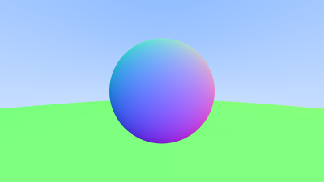

# Ray Tracer

A C++ ray tracer built while working through _Ray Tracing in One Weekend_. This project is a learning-focused renderer that builds the graphics pipeline from first principles: vectors, rays, hittable objects, sphere intersections, camera setup, surface normals, and antialiasing.



## Highlights

- Implements a small ray tracing renderer in C++.
- Builds core rendering primitives from scratch: `vec3`, `ray`, `sphere`, `hittable`, `hittable_list`, `interval`, `color`, and `camera`.
- Renders to PPM and converts the output to PNG for viewing.
- Adds antialiasing with multiple jittered samples per pixel.
- Includes a learning log in `notes.md` explaining the rendering math and implementation decisions.

## Tech Stack

- C++
- CMake
- ImageMagick for converting `.ppm` renders to `.png`

## Build and Run

Configure and build:

```bash
cmake -B build
cmake --build build
```

Render the image:

```bash
build\Debug\inOneWeekend.exe > image.ppm
```

Convert the render to PNG:

```bash
magick image.ppm image.png
```

## Project Structure

- `main.cpp`: Builds the scene and starts rendering.
- `camera.h`: Camera setup, render loop, ray generation, and pixel sampling.
- `vec3.h`: 3D vector math.
- `ray.h`: Ray origin/direction model.
- `sphere.h`: Sphere hit logic.
- `hittable.h`: Shared hit-record and hittable-object interface.
- `hittable_list.h`: Scene container for hittable objects.
- `color.h`: Pixel color output.
- `interval.h`: Numeric intervals and clamping.
- `rtweekend.h`: Shared constants, includes, and random helpers.
- `notes.md`: Learning notes and implementation log.

## Status

Work in progress. The renderer currently covers the early foundations of ray tracing and is ready for the next steps: diffuse materials, reflections, camera depth of field, more complex scenes, and cleaner material abstractions.

