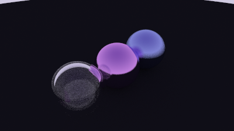

# Ray Tracer

A C++ ray tracer built while working through _Ray Tracing in One Weekend_. This project is a learning-focused renderer that builds the graphics pipeline from first principles: vectors, rays, hittable objects, sphere intersections, camera setup, antialiasing, recursive ray scattering, diffuse materials, reflective metal surfaces, dielectric glass, refraction, and a positionable camera.



_Current render: a glass hollow sphere, reflective metal spheres, diffuse ground material, antialiasing, recursive bounces, refraction, and a positionable camera view._

## Implemented Features

- [x] Vector math (`vec3`)
- [x] Rays and camera ray generation
- [x] Sphere intersections
- [x] Hittable object abstraction
- [x] Multiple objects through a hittable list
- [x] Surface normal visualization
- [x] Antialiasing through multisampling
- [x] Recursive ray scattering with configurable max bounce depth
- [x] Lambertian diffuse material
- [x] Reflective metal material
- [x] Configurable metal fuzz for sharper or softer reflections
- [x] Dielectric/glass material
- [x] Refraction using Snell's law
- [x] Schlick-style reflectance approximation
- [x] Hollow glass sphere setup using nested dielectric spheres
- [x] Positionable camera with `lookfrom`, `lookat`, `vup`, and vertical field of view
- [x] Shadow-acne avoidance using a small ray-hit epsilon
- [x] PPM output and PNG conversion workflow
- [ ] Depth of field
- [ ] More complex scenes

## Highlights

- Implements a small ray tracing renderer in C++.
- Builds core rendering primitives from scratch: `vec3`, `ray`, `sphere`, `hittable`, `hittable_list`, `interval`, `color`, and `camera`.
- Adds a material abstraction with `lambertian`, `metal`, and `dielectric` surface scattering.
- Uses recursive rays to model light bounces, reflections, refraction, attenuation, and object-to-object reflections.
- Implements a movable camera so scenes can be framed from different positions and fields of view.
- Renders to PPM and converts the output to PNG for viewing.
- Adds antialiasing with multiple jittered samples per pixel.
- Includes a learning log in `notes.md` explaining the rendering math and implementation decisions.

## Tech Stack

- C++
- CMake
- ImageMagick for converting `.ppm` renders to `.png`

## Build and Run

Configure and build:

```bash
cmake -B build
cmake --build build
```

Render the image:

```bash
build\Debug\inOneWeekend.exe > image.ppm
```

Convert the render to PNG:

```bash
magick image.ppm image.png
```

## Project Structure

- `main.cpp`: Builds the scene and starts rendering.
- `camera.h`: Positionable camera setup, render loop, ray generation, and pixel sampling.
- `vec3.h`: 3D vector math.
- `ray.h`: Ray origin/direction model.
- `sphere.h`: Sphere hit logic.
- `hittable.h`: Shared hit-record and hittable-object interface.
- `hittable_list.h`: Scene container for hittable objects.
- `material.h`: Lambertian diffuse, reflective metal, and dielectric/glass material scattering.
- `color.h`: Pixel color output.
- `interval.h`: Numeric intervals and clamping.
- `rtweekend.h`: Shared constants, includes, and random helpers.
- `notes.md`: Learning notes and implementation log.
- `renders/glass_hollow_sphere_scene.png`: Current portfolio render.

## What It Demonstrates

| Area | Evidence in this project |
|---|---|
| C++ fundamentals | Builds math, ray, camera, and scene abstractions directly. |
| Graphics math | Uses ray-sphere intersections, normals, recursive scattering, sampling, refraction, and color output. |
| Rendering materials | Implements diffuse, metal, and dielectric materials with attenuation, reflection, refraction, and fuzz. |
| Camera systems | Supports configurable camera position, target, up vector, and vertical field of view. |
| Build tooling | Uses CMake and a repeatable render-to-image workflow. |
| Learning process | `notes.md` documents implementation decisions and debugging lessons. |

## Status

Work in progress. The renderer currently supports antialiasing, diffuse surfaces, reflective metal materials, dielectric glass, refraction, Schlick reflectance, hollow glass spheres, recursive bounce depth, and a positionable camera. Next steps are depth of field, camera defocus blur, and more complex scene composition.
